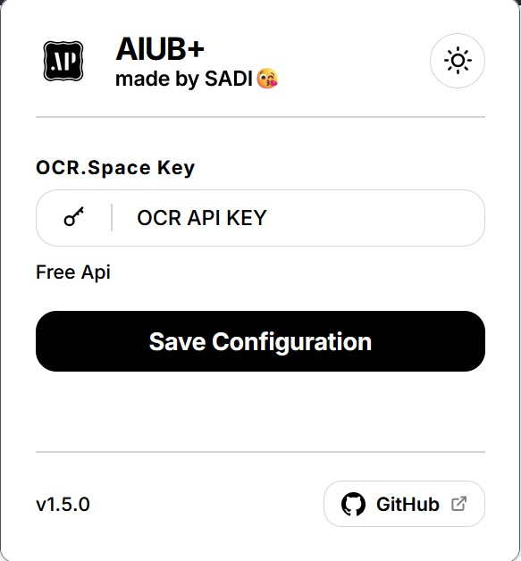
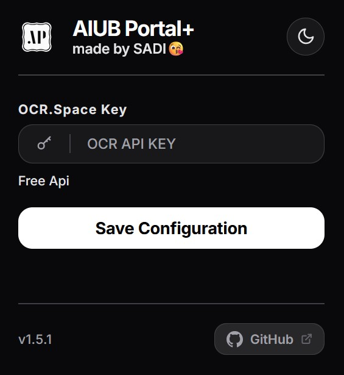

  
  <h1>AIUB Portal+</h1>
  
<i>The ultimate productivity companion for AIUB students.</i>

  
  
  

---

### 🚀 Enhance Your Portal Experience
**AIUB Portal+** is a minimalist browser extension designed to eliminate the friction of daily portal logins. No more manual captcha solving or clicking "Login" repeatedly.

### 🌟 Key Features
- **⚡ Instant Auto-Login:** Logs you in automatically as soon as credentials are ready.
- **🤖 Smart Captcha Solver:** An integrated OCR engine that solves math problems in real-time.
- **🎨 Modern Aesthetics:** Premium minimalist design with full dark mode support.
- **🦊 Cross-Platform:** Perfectly optimized for both Chromium and Firefox.
- **🔒 Privacy-Focused:** Your data stays on your machine. Support for custom OCR API keys.

---

### 📸 Interface Preview

  
  &nbsp;&nbsp;&nbsp;&nbsp;&nbsp;&nbsp;&nbsp;&nbsp;&nbsp;&nbsp;&nbsp;&nbsp;
  

---

### 📥 Installation

#### 🌐 For Chromium Browsers (Chrome, Brave, Edge)
1. **Download** the latest release [here](https://github.com/sakibmahmudsadi/AIUB_Portal_plus/releases).
2. **Extract** the ZIP file to a folder.
3. Go to `chrome://extensions/` and enable **Developer Mode** (top right).
4. Click **Load unpacked** and select the extracted folder.

#### 🦊 For Firefox
1. Simply install from the [Official Firefox Add-ons Store](https://addons.mozilla.org/en-US/firefox/addon/aiub_portal_plus/).

---

### 🎥 Visual Guides
* [Watch Installation Video](assets/video.mp4)

---

> [!NOTE]
> This project is intended for educational purposes. It does not collect or transmit any user data. All processing happens locally or via your chosen OCR endpoint.

